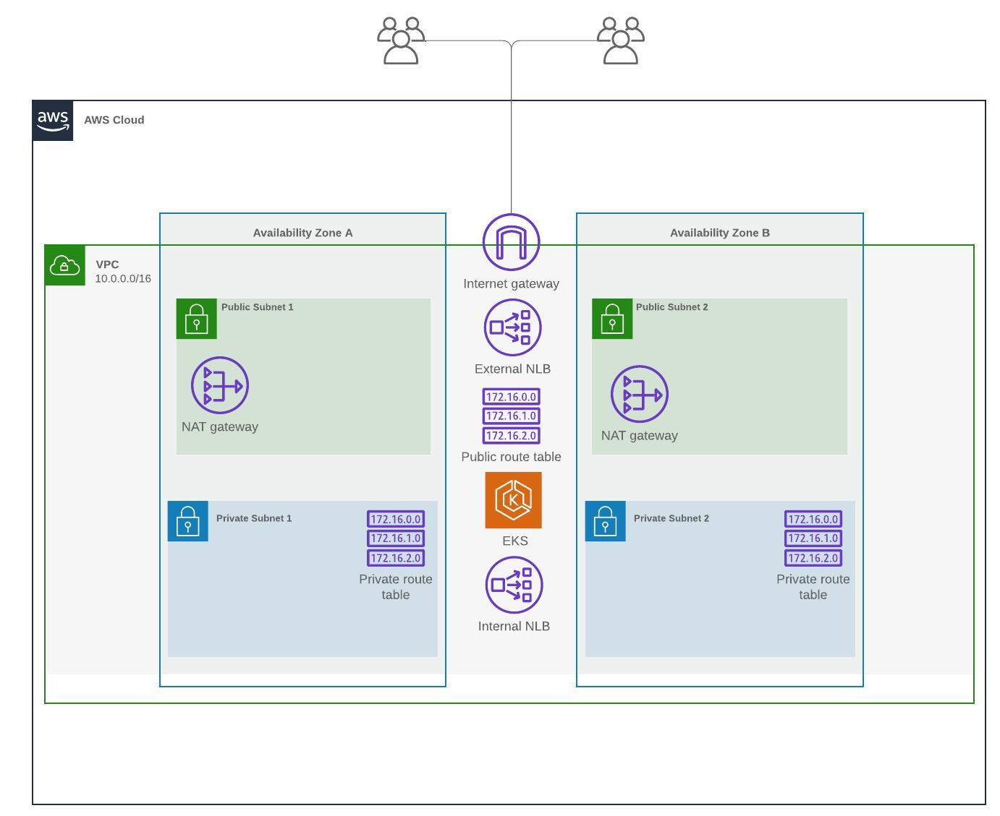

# Project Title

This project represents infrastructure managed with Terraform for creating AWS resources and Golang app based on EKS cluster.

The infrastructure is shown in the figure below.


## Infrastructure diagram




## Prerequisites

You must have Terraform installed on your computer. You can download it from the official Terraform website.


## Installation

Installation

```bash
  git clone https://github.com/ramp23/facts.git
  cd facts
```
## Creating the infrastructure

Before you create the infrastructure you need to configure terraform.tfstate in S3 bucket with blocking mechanism.
So first of all, you need to comment backend section in infrastructure/global/backend-state.tf:
```bash
  # backend "s3" {
  #   bucket                  = "moonactive-terraform-state"
  #   key                     = "global/s3/terraform.tfstate"
  #   region                  = "eu-central-1"
  #   profile                 = "moonactive"
  #   shared_credentials_file = "/home/bear/.aws/credentials"
  #   dynamodb_table          = "moonactive-terraform-state-locks"
  #   encrypt                 = true
  # }
```
Change variables in .tf files and run the command to initialize Terraform locally:
```bash
  cd infrastructure/global
  terraform init
  terraform apply
```
Then you need to initialize terraform backend. Uncomment the section backend, change values in it and run `terraform init` once again without coping terraform.tfstate in S3.

Please, replace the values with yours. You must change principals in infrastructure/eks-role-main.tf and backend data in infrastructure/backend.tf.

Now you can install the infrastructure:
```bash
  terraform init
  terraform apply
```


## Deploy application

After installation of EKS cluster you can deploy the helm chart on it.
You can simply run the GitHub Actions pipeline to do it.

Firstly you must provide some env variables in ./github/workflows/deploy.yml:
```bash
  AWS_REGION: eu-central-1
  CLUSTER_NAME: MoonActive
  PROFILE_NAME: eks-cluster
  AWS_ACCOUNT_ID: 849234523634
  NAMESPACE: facts
```
and create secrets AWS_ACCESS_KEY_ID and AWS_SECRET_ACCESS_KEY.

When you run a github pipeline you must provide Facts service name which will be deployed.

The Facts service name should be the same as values.yaml filename.


